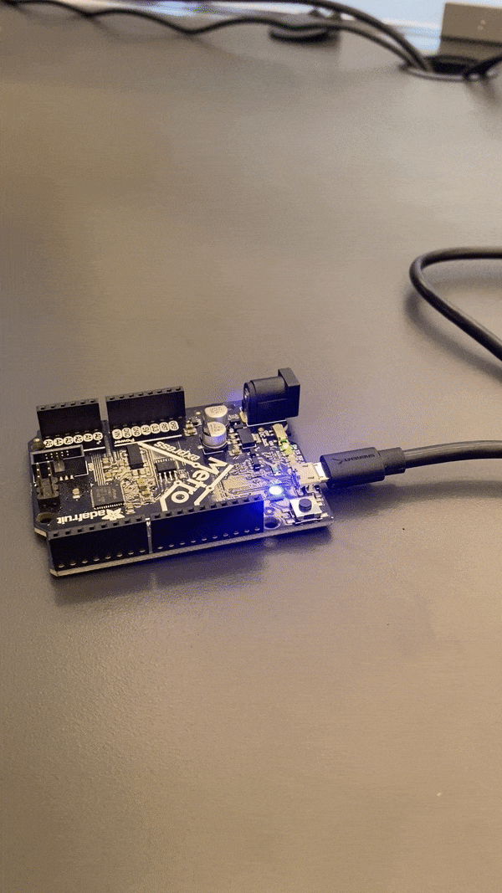
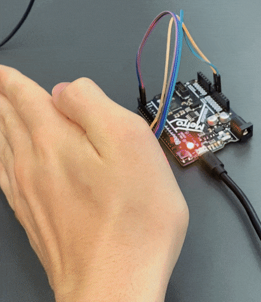
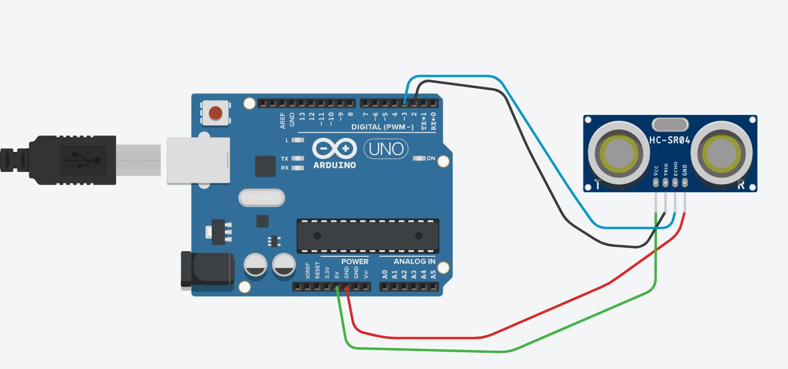

# CircuitPython
 The following files are my first foray into CircuitPython.
## Table of Contents
* [Table of Contents](#TableOfContents)
* [Hello_CircuitPython](#Hello_CircuitPython)
* [CircuitPython_Servo](#CircuitPython_Servo)
* [CircuitPython_DistanceSensor](#CircuitPython_DistanceSensor)
* [NextAssignmentGoesHere](#NextAssignment)
---

## Hello_CircuitPython

### Description & Code

```python
import board
import neopixel
import time

dot = neopixel.NeoPixel(board.NEOPIXEL, 1)

dot.brightness=0.2

while True:
    print("Make it Green!")
    dot.fill((0, 255, 0))     #this is the RGB color value for green
    time.sleep(.5)            #Time sleep is how long it stays on that color before switching.
    print("Make it Blue!")
    dot.fill((0, 0, 255))    #this is the RGB color value for blue
    time.sleep(.5)


```


### Evidence



### Wiring


### Reflection

One thing that went wrong was that I didn't know I had to "Import Time." Once I did that, it worked and it blinked the colors back and forth. This was a nice and easy warm up to start learning how to code in the python language and I look forward to keep working on it.


## CircuitPython_Servo

### Description & Code

In this assignment, we used a metro express board, a micro servo, and python coding to make the servo turn 180 degrees and then back 180 degrees. After we firgured that out, we added two loose wires to make capacitive touch controlled. 

```python
import time
import board
import pulseio
import touchio  # Import capacitive touch
import servo

# create a PWMOut object on Pin A2.
pwm = pulseio.PWMOut(board.A2, duty_cycle=2 ** 15, frequency=50)

# Create a servo object, my_servo.
my_servo = servo.Servo(pwm)

touch_pad1 = board.A0  # Will not work for Circuit Playground Express!   (Orange wire)
touch1 = touchio.TouchIn(touch_pad1)
touch_pad2 = board.A5  # Will not work for Circuit Playground Express!   (White wire)
touch2 = touchio.TouchIn(touch_pad2)

while True:

    if touch1.value:      # This is the orange wire
        print("Touched the Orange Wire!")
        for angle in range(0, 180, 5):  # 0 - 180 degrees, 5 degrees at a time.
            my_servo.angle = angle
            time.sleep(0.05)
    if touch2.value:     # This is the gray wire
        print("Touched the Gray Wire!")
        for angle in range(180, 0, -5):  # 180 - 0 degrees, 5 degrees at a time
            my_servo.angle = angle
            time.sleep(0.05)
    time.sleep(0.05)
    print("end of loop!")

```

### Evidence


### Wiring


### Reflection

This assignment helped me learn about the python coding language. The hardest part of this assignment was the touch capacitive part. I struggled finding the right code, but Callan and Mr. Helmstetter helped me figure it out. For other people trying this assignment I would recommend having friends around to ask and using all of the tools around you. 


## CircuitPython_DistanceSensor

### Description & Code

```python
import time
import board
import neopixel  # (the led dot on the board)
import simpleio
import adafruit_hcsr04

sonar = adafruit_hcsr04.HCSR04(trigger_pin=board.D2, echo_pin=board.D3)
dot = neopixel.NeoPixel(board.NEOPIXEL, 1)

r = 0
cm = 0
while True:
    try:
        cm = sonar.distance
        print((cm))
        if cm < 5:  # If distance is less than 5 cm
            r = 255
            g = 0
            b = 0
            print("red!")
        elif cm < 20:   # If distance is less than 20 cm
            print("red or blue")  # Fades from red to blue from 5 cm to 20 cm. (Color is blue at 20 cm)
            r = simpleio.map_range(cm, 5, 20, 255, 0)
            g = 0 
            b = simpleio.map_range(cm, 5, 20, 0, 255)
        
        elif cm < 35:    # If distance is less than 35 cm
            print("blue or fade out")      # Fades from blue to nothing from 20cm to 35cm 
            r = 0
            g = simpleio.map_range(cm, 20, 35, 0, 255)
            b = simpleio.map_range(cm, 20, 35, 255, 0)
        else:
            print("nothing")
        dot.fill((int(r), int(g), int(b)))
        
    except RuntimeError:
        print("Retrying!")
    time.sleep(0.1)

```

### Evidence



### Wiring



### Reflection

On this assignment, I struggled with my Metro Express Board not showing the color green. Mr. H helped me figure out that It was the board that was malfunctioning. One of the LED's was broken, so I figured out how to make it fade from red, to blue, and then fade out to nothing. I had fun figuring out my problem and it was cool to watch it work in the end. 


## NextAssignment

### Description & Code

```python
Code goes here

```

### Evidence

### Wiring

### Reflection
